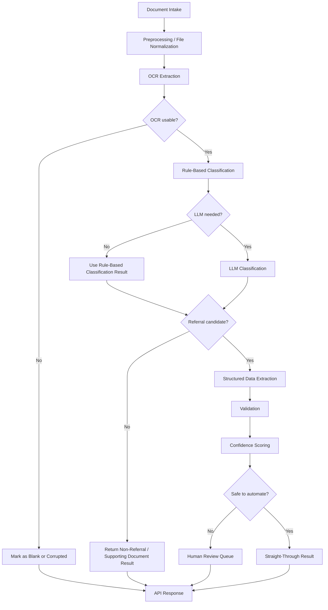

# Referral AI Backend Manager Summary

## 1. Approach

The backend uses a **hybrid AI approach** instead of relying only on OCR, only rules, or only an LLM.

The system combines:
- **OCR** to read scanned documents
- **Rule-based scoring** for fast and explainable first-pass decisions
- **LLM-based reasoning** for deeper classification and structured extraction
- **Validation and confidence scoring** to decide whether automation is safe

This approach gives us:
- better accuracy than keyword-only processing
- lower cost than sending every file to the LLM
- better explainability for operations and compliance
- safer handling of incomplete or poor-quality referrals

---

## 2. App Flow

### End-to-end flow

```text
Document Intake
-> Preprocessing / File Normalization
-> OCR Extraction
-> Rule-Based Classification
-> Optional LLM Classification
-> Structured Data Extraction
-> Validation
-> Confidence Scoring
-> Human Review Decision
-> API Response
```

### Flow chart



### How it works internally

1. **Document Intake**
- The API accepts PDFs, images, TIFF/fax files, and archive uploads.
- Files are safely spooled to temporary storage instead of being fully loaded into memory.

2. **Preprocessing / File Normalization**
- If the input is a ZIP or archive, the backend expands it safely.
- Each supported file becomes its own processing unit.
- Unsupported or unsafe archive contents are skipped or rejected safely.

3. **OCR Extraction**
- OCR reads the document and returns text, markdown, page count, and OCR quality.
- If OCR fails, the document is marked as `CORRUPTED_DOCUMENT`.
- If OCR returns no meaningful text, the document is marked as `BLANK_DOCUMENT`.

4. **Rule-Based Classification**
- Rules run first on OCR text.
- This produces an initial decision such as:
  - referral
  - self-referral
  - non-referral medical
  - non-medical
  - low-confidence

5. **Optional LLM Classification**
- The LLM is not always called.
- The LLM is skipped when:
  - the document is blank
  - the document is corrupted
  - OCR returned no useful text
  - OCR text is too short to justify LLM processing
- If rule gating is enabled in config, rules can also stop obvious non-referrals or very weak cases before LLM.

6. **Structured Data Extraction**
- For likely referral documents, the system extracts:
  - patient details
  - provider details
  - insurance details
  - referral reason
  - diagnosis, ICD, CPT, specialty, priority

7. **Validation**
- The extracted data is validated based on referral type.
- Provider referrals and self-referrals follow different validation rules.

8. **Confidence Scoring**
- The system combines OCR confidence, rule confidence, LLM confidence, extraction confidence, and validation confidence into one final score.

9. **Human Review Decision**
- If confidence is low, fields are missing, OCR is poor, or classifiers disagree, the document is routed for human review.
- Otherwise it can move forward as a straight-through processed result.

---

## 3. Positive / Negative Scoring

The solution uses **both positive and negative scoring signals**.

### Positive scoring
Positive scoring increases confidence that the document is a referral.

Examples of positive signals:
- `referral`
- `referred`
- `reason for referral`
- `specialty`
- `provider`
- `diagnosis`
- `npi`
- `fax`
- `insurance`
- `dob`

These signals help identify:
- referral forms
- provider referral forms
- structured clinical documents with referral intent

### Negative scoring
Negative scoring increases confidence that the document is **not** a referral.

Examples of negative signals:
- `invoice`
- `receipt`
- `bank`
- `terms and conditions`
- `employment`
- `resume`

These signals help the system avoid false positives.

### Why both are important

Medical document processing is not reliable if we only look for referral words.

Examples:
- insurance cards may contain medical terms but are not referrals
- invoices may contain provider names but are not referrals
- clinical records may mention diagnosis but are not necessarily referral forms

That is why the backend uses:
- **positive scoring** to detect referral intent
- **negative scoring** to reject non-referral intent

---

## 4. Thresholds

Thresholds are used to control when the system should:
- trust automation
- call the LLM
- trigger human review
- treat OCR as poor quality

### Current key thresholds

| Threshold | Current Value | Purpose |
|---|---:|---|
| `MIN_TEXT_ALPHA_CHARS_FOR_LLM` | 100 | Avoid LLM calls on very short or noisy OCR text |
| `RULE_REFERRAL_THRESHOLD` | 0.55 | Minimum rule score considered strong enough for referral support |
| `LLM_REFERRAL_THRESHOLD` | 0.55 | Minimum LLM score considered strong enough for referral support |
| `LOW_CONFIDENCE_THRESHOLD` | 0.60 | Keeps uncertain cases in low-confidence state |
| `REVIEW_CONFIDENCE_THRESHOLD` | 0.72 | Below this, straight-through automation is not trusted |
| `OCR_POOR_QUALITY_THRESHOLD` | 0.55 | OCR below this is treated as poor quality |
| `CLASSIFIER_DISAGREEMENT_THRESHOLD` | 0.35 | Maximum acceptable rule-vs-LLM disagreement |
| `RULE_LLM_GATE_THRESHOLD` | 0.20 | If rule gate is enabled, only stronger weak-referral cases go to LLM |
| `CONSIDER_FOR_HUMAN_REVIEW` | 0.90 | Added caution threshold for valid-but-not-strong cases |

### Business meaning of thresholds

- **Lower thresholds** increase automation but also increase risk.
- **Higher thresholds** reduce risk but push more documents to human review.
- These thresholds are intentionally configurable through `.env` so the team can tune them during rollout.

---

## 5. Rule-Based Processing

Rule-based processing is the system’s **first decision layer**.

### What rules are used for
- Fast early classification
- Cost control by reducing unnecessary LLM calls
- Explainable decision support
- Consistent handling of obvious cases

### What rules detect
- blank documents
- corrupted documents
- self-referral forms
- standard referral forms
- non-referral medical documents
- non-medical documents
- weak or uncertain cases

### Why rules matter
- Rules are fast
- Rules are transparent
- Rules work even if the LLM is unavailable
- Rules create a dependable fallback path

### Examples of rule-based outcomes
- Blank document -> no LLM needed
- Corrupted OCR result -> no LLM needed
- Strong self-referral cues -> self-referral classification
- Strong invoice/receipt cues -> non-medical classification
- Mixed signals -> low-confidence classification, then optionally LLM review

---

## 6. LLM-Based Processing

The LLM is the system’s **second decision layer**.

### What the LLM is used for
- refine document classification
- identify referral type more accurately
- classify non-referral document type more clearly
- extract structured referral entities
- provide confidence-backed reasoning in structured JSON

### What the LLM is not used for
- blank documents
- corrupted documents
- useless OCR output
- very short OCR text

### Why the LLM is used selectively
- saves cost
- reduces latency
- avoids sending low-value text to the model
- keeps the pipeline usable even when Ollama is unavailable

### LLM output is used for
- `document_state`
- `document_type`
- `document_category`
- `referral_type`
- extraction of patient/provider/insurance/clinical fields
- field-level confidence support

---

## 7. Manager-Level Summary

This backend is designed to automate referral intake safely, not blindly.

Its operating model is:
- **OCR first** to read the document
- **Rules second** to make a fast and explainable decision
- **LLM third** only when deeper reasoning is worth the cost
- **Validation and confidence scoring** before trusting automation
- **Human review routing** when risk or uncertainty is high

This makes the solution:
- scalable
- explainable
- cost-aware
- safer for healthcare workflows
