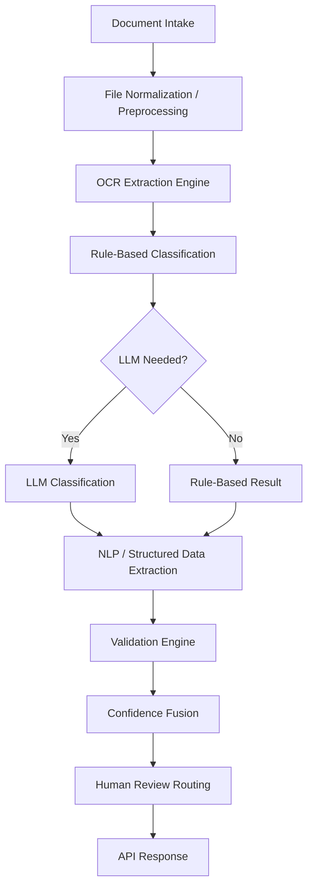

# Referral AI System Backend Solution Document

## 1. Purpose of This Document

This document explains the backend-only design of the Referral AI System built for automated referral intake and processing.

It is intended for:
- Engineering managers
- Backend developers
- AI/ML engineers
- QA and support teams
- Technical stakeholders reviewing the solution

This document excludes:
- Frontend/dashboard implementation details
- Database integration details

Current scope covered here:
- Document intake
- OCR
- Rule-based classification
- LLM-based classification and extraction
- NLP entity extraction
- Confidence scoring
- Validation
- Human review routing
- Batch-safe backend orchestration

---

## 2. Solution Summary

The Referral AI System backend is an enterprise-oriented FastAPI pipeline that processes uploaded healthcare documents such as PDFs, images, TIFF/fax files, and archives.

The backend is designed to:
- Identify whether a document is a referral or not
- Detect self-referrals separately from provider referrals
- Detect incomplete referrals
- Extract structured referral data
- Score the quality and confidence of each stage
- Route uncertain cases to human review
- Process files safely in batches without failing the full request

The design uses a hybrid AI strategy:
- OCR for text acquisition
- Rule-based scoring for fast deterministic decisions
- LLM-based reasoning for classification and extraction refinement
- Confidence fusion for final decision support

---

## 3. Technology Stack

### Backend Framework
- FastAPI
- Python
- Pydantic / Pydantic Settings

### OCR Layer
- `docling` via `DocumentConverter`

### LLM Layer
- Ollama
- Current configured model: `gemma4:e4b`

### Supporting Techniques
- Regex-based deterministic extraction
- Async processing with semaphores
- Timeout and retry controls
- Structured logging
- Batch orchestration

---

## 4. High-Level Backend Flow

The current implemented backend flow is:

Important note:
- OCR happens before classification because scanned PDFs, TIFFs, and fax-like documents need text extraction before classification can be reliable.
- Rules always run before LLM.
- The LLM is called selectively based on OCR quality and rule-gate conditions.

---

## 5. Current Implemented Architecture

### API Layer
- `app/main.py`
- `app/api/routes/referral.py`

Responsibilities:
- Expose single-file and batch endpoints
- Support archive uploads
- Return dashboard-compatible API payloads

### Orchestration Layer
- `app/pipelines/referral_pipeline.py`
- `app/services/batch_orchestrator.py`

Responsibilities:
- Manage the end-to-end flow
- Track timing for each stage
- Preserve batch fault isolation
- Convert internal results to API output

### Intake / File Safety Layer
- `app/services/file_handler_service.py`

Responsibilities:
- Normalize uploads
- Support archive extraction
- Spool uploads to disk
- Avoid loading large files fully into memory

### OCR Layer
- `app/services/ocr_service.py`

Responsibilities:
- Run OCR through Docling
- Produce raw text and markdown
- Estimate OCR confidence heuristically

### Classification Layer
- `app/services/classification_service.py`

Responsibilities:
- Run rules first
- Optionally escalate to LLM
- Classify document state, category, type, and referral type

### Extraction Layer
- `app/services/extraction_service.py`

Responsibilities:
- Extract patient, provider, insurance, and clinical fields
- Combine regex extraction with LLM extraction
- Produce field-level confidence scores

### Validation Layer
- `app/services/validation_service.py`

Responsibilities:
- Check completeness
- Apply different rules for provider referral vs self-referral
- Detect missing required data

### Confidence and Review Layer
- `app/services/confidence_fusion_service.py`
- `app/services/review_routing_service.py`

Responsibilities:
- Combine OCR, rule, LLM, extraction, and validation signals
- Decide whether human review is needed
- Explain why review was triggered

### Observability Layer
- `app/core/logging.py`
- `app/services/logging_service.py`

Responsibilities:
- Structured logs
- Stage-level event logging
- Duration/timing visibility

---

## 6. Backend Endpoints

### Single File
`POST /referrals/analyze`

Used for:
- Single PDF
- Single image
- Single TIFF/fax-derived upload

If an archive is uploaded here, it is internally expanded and returned as batch-style output.

### Batch
`POST /referrals/analyze-batch`

Used for:
- Multiple uploaded files
- Mixed upload sets
- Batch-safe processing

---

## 7. Models and AI Components Used

## 7.1 OCR Model / OCR Engine

Current OCR implementation:
- `docling.document_converter.DocumentConverter`

Used for:
- PDFs
- Images
- TIFF/fax-like documents
- Multi-page documents

OCR output:
- Plain extracted text
- Markdown representation
- Page count
- Heuristic OCR quality score

Important note:
- The current OCR layer does not expose a native per-token OCR confidence.
- The system derives OCR quality heuristically using text density and blank-output behavior.

## 7.2 LLM Used

Current LLM runtime:
- Ollama

Configured model:
- `gemma4:e4b`

Used for:
- Document classification refinement
- Structured extraction
- Confidence-assisted reasoning

Prompt files:
- `app/prompts/classification_prompt.txt`
- `app/prompts/extraction_prompt.txt`

LLM output style:
- Strict JSON only
- Deterministic prompt design
- No free-form narrative in system output

## 7.3 NLP / Entity Extraction Method

The extraction layer is hybrid:

### Deterministic extraction
- Regex for:
  - Date of birth
  - Phone numbers
  - ICD codes
  - CPT codes

### LLM-assisted extraction
- Patient name
- Provider name
- Insurance name
- Referral reason
- Specialty
- Priority
- Diagnosis
- Structured field-level confidences

---

## 8. Document States Supported

The backend classifies each document into one of these states:

- `VALID_REFERRAL`
- `INCOMPLETE_REFERRAL`
- `SELF_REFERRAL`
- `NON_REFERRAL_MEDICAL`
- `NON_MEDICAL_DOCUMENT`
- `LOW_CONFIDENCE_REFERRAL`
- `BLANK_DOCUMENT`
- `CORRUPTED_DOCUMENT`

This gives the backend a full decision vocabulary instead of forcing all documents into a referral/non-referral binary.

---

## 9. Document Categories Supported

The solution also assigns a document category:

- `Referral`
- `Medical Supporting Document`
- `Non Medical Document`
- `Unknown`

Examples:
- Referral form -> `Referral`
- Insurance card -> `Medical Supporting Document`
- Invoice -> `Non Medical Document`

---

## 10. Referral Types Supported

The backend supports:
- `PROVIDER_REFERRAL`
- `SELF_REFERRAL`
- `UNKNOWN`

Why this matters:
- Self-referrals may not contain provider information
- Validation rules must adapt based on referral type

---

## 11. Detailed Processing Flow

## 11.1 Document Intake and Preprocessing

Handled by:
- `FileHandlerService`

What happens:
- Validate supported file extension
- Spool uploaded content to temp storage
- Avoid loading full large files into RAM
- Expand archives safely
- Create normalized document objects for downstream processing

Supported file groups:
- PDF
- DOC / DOCX
- JPG / JPEG / PNG / GIF / BMP / TIFF / TIF / WEBP
- ZIP / TAR / TGZ / TAR.GZ

## 11.2 OCR Extraction

Handled by:
- `OCRService`

What happens:
- OCR runs with timeout protection
- OCR runs under concurrency control
- Blocking OCR is moved to worker threads
- OCR returns raw text, markdown, total pages, and quality metrics

OCR quality fields:
- `average_confidence`
- `text_density`
- `blank_page_ratio`
- `poor_quality`

## 11.3 Rule-Based Classification

Handled by:
- `ClassificationService._rule_classification()`

What happens:
- OCR text is scored for positive referral signals
- OCR text is scored for supporting-medical signals
- OCR text is scored for negative non-medical signals
- OCR text is scored for self-referral signals
- Lightweight layout cues are also scored

This gives a cheap and fast pre-LLM classification result.

## 11.4 Optional LLM Classification

Handled by:
- `ClassificationService._classify_with_llm()`

What happens:
- The LLM is only called if the input passes preconditions
- The LLM refines:
  - document state
  - document type
  - document category
  - referral type
  - classification confidence

## 11.5 Extraction

Handled by:
- `ExtractionService`

What happens:
- Regex extraction runs first
- LLM extraction enriches or overrides regex values when useful
- Structured extracted data is returned
- Field-level confidence is attached

## 11.6 Validation

Handled by:
- `ValidationService`

What happens:
- Determine required fields
- Check whether the referral is complete
- Apply self-referral vs provider-referral profiles
- Add warnings for missing insurance or poor OCR

## 11.7 Confidence Fusion

Handled by:
- `ConfidenceFusionService`

What happens:
- OCR score
- Rule score
- LLM score
- Extraction score
- Validation score

All of these are weighted and fused into a final confidence score.

## 11.8 Human Review Routing

Handled by:
- `ReviewRoutingService`

What happens:
- If confidence is low
- or rules and LLM disagree materially
- or required fields are missing
- or OCR quality is poor

Then the document is routed to human review with explicit reasons.

---

## 12. Rule-Based Logic Used

The classification service uses explicit weighted keyword scoring.

## 12.1 Positive Referral Signals

These increase referral intent:

| Signal | Weight | Purpose |
|---|---:|---|
| `referral` | 0.22 | Strong referral indicator |
| `referred` | 0.20 | Referral intent indicator |
| `reason for referral` | 0.18 | Strong referral form clue |
| `specialty` | 0.10 | Referral routing clue |
| `provider` | 0.06 | Referring-provider clue |
| `diagnosis` | 0.07 | Clinical support for referral |
| `npi` | 0.05 | Provider-related form clue |
| `fax` | 0.05 | Referral/fax workflow clue |
| `insurance` | 0.04 | Supporting healthcare form clue |
| `dob` | 0.03 | Form-structure clue |

## 12.2 Self-Referral Signals

These identify self-referral specifically:

| Signal | Weight | Purpose |
|---|---:|---|
| `self referral` | 0.45 | Strong self-referral indicator |
| `self-referral` | 0.45 | Same as above |
| `self referred` | 0.40 | Strong self-referral wording |
| `self-referred` | 0.40 | Same as above |

## 12.3 Supporting Medical Signals

These indicate medical documents that are not necessarily referrals:

| Signal | Weight | Purpose |
|---|---:|---|
| `member id` | 0.16 | Insurance/supporting doc clue |
| `policy` | 0.12 | Insurance clue |
| `claim` | 0.10 | Billing/supporting medical clue |
| `insurance card` | 0.26 | Strong insurance-card clue |
| `lab result` | 0.20 | Lab document clue |
| `radiology` | 0.16 | Radiology report clue |
| `discharge` | 0.18 | Discharge summary clue |

## 12.4 Negative / Non-Medical Signals

These reduce referral likelihood:

| Signal | Weight | Purpose |
|---|---:|---|
| `invoice` | 0.25 | Non-medical business document clue |
| `receipt` | 0.22 | Non-medical transaction clue |
| `bank` | 0.20 | Non-medical financial clue |
| `terms and conditions` | 0.16 | Non-medical legal/administrative clue |
| `employment` | 0.12 | Non-medical HR clue |
| `resume` | 0.12 | Non-medical recruiting clue |

## 12.5 Layout Signals

These simulate form-layout awareness from OCR output:

| Signal | Weight | Purpose |
|---|---:|---|
| Checkbox markers such as `[ ]`, `[x]`, `checkbox` | 0.10 | Form-like layout indicator |
| `provider` or `referred by` structure | 0.10 | Referral/provider layout clue |

Maximum layout contribution:
- `0.20`

---

## 13. Scoring Approach (Pos / Neg)

The solution uses both positive and negative scoring.

### Positive scoring
Positive signals increase confidence that:
- the document is a referral
- the document is a self-referral
- the document contains referral structure

### Negative scoring
Negative signals increase confidence that:
- the document is non-medical
- the document is not a referral
- the document may be a supporting medical document only

### Why both are needed
A referral pipeline should not classify documents only by presence of words like `provider` or `insurance`.

Example:
- Insurance cards and lab reports may still contain medical terms
- Invoices may still mention a provider or patient

Using both positive and negative signals reduces false positives.

---

## 14. Thresholds Used in the Current Backend

The following threshold values are currently configured in `.env`.

| Config Key | Value | Purpose |
|---|---:|---|
| `REVIEW_CONFIDENCE_THRESHOLD` | 0.72 | Below this, the document is not safe for straight-through automation |
| `LOW_CONFIDENCE_THRESHOLD` | 0.60 | Used to keep uncertain classifications in low-confidence state |
| `CLASSIFIER_DISAGREEMENT_THRESHOLD` | 0.35 | Maximum acceptable gap between rule score and LLM score |
| `OCR_POOR_QUALITY_THRESHOLD` | 0.55 | OCR below this is treated as poor quality |
| `RULE_REFERRAL_THRESHOLD` | 0.55 | Rule score must pass this to be considered strong enough |
| `MIN_TEXT_ALPHA_CHARS_FOR_LLM` | 100 | Avoid LLM on extremely short/noisy OCR output |
| `USE_RULE_GATE_FOR_LLM` | `false` | If `true`, rules can block LLM for obvious non-referrals and weak referral intent |
| `RULE_LLM_GATE_THRESHOLD` | 0.20 | Referral intent threshold used when rule gating is enabled |
| `LLM_REFERRAL_THRESHOLD` | 0.55 | LLM classification score must pass this threshold |
| `AGREEMENT_MIN_SCORE` | 0.65 | Intended agreement baseline for classifier consistency tracking |
| `CONSIDER_FOR_HUMAN_REVIEW` | 0.90 | Additional caution threshold for valid referrals with lower confidence |

---

## 15. What Each Threshold Is Used For

## 15.1 `MIN_TEXT_ALPHA_CHARS_FOR_LLM`

Purpose:
- Prevent unnecessary LLM calls on blank or nearly blank OCR output

Use:
- If OCR text contains fewer than 100 alphabetic characters, the LLM is skipped

Why:
- Saves cost and latency
- Avoids sending meaningless OCR output to the LLM

## 15.2 `USE_RULE_GATE_FOR_LLM`

Purpose:
- Allow the rule engine to block unnecessary LLM calls

Use when `true`:
- Skip LLM for clearly non-medical documents
- Skip LLM for clearly non-referral medical documents
- Skip LLM for weak low-confidence referral intent below the configured threshold

Current value:
- `false`

Meaning today:
- The LLM is not blocked by rules except for blank/corrupted/very-short OCR conditions

## 15.3 `RULE_LLM_GATE_THRESHOLD`

Purpose:
- Defines how much referral-intent score is required before escalating a weak case to LLM

Use:
- Only active when `USE_RULE_GATE_FOR_LLM=true`

## 15.4 `RULE_REFERRAL_THRESHOLD`

Purpose:
- Decide whether the rule engine itself considers the document strongly referral-like

Use:
- Exposed in classification evidence
- Used in review reasoning

## 15.5 `LLM_REFERRAL_THRESHOLD`

Purpose:
- Decide whether the LLM classification is strong enough to support referral classification

Use:
- Exposed in classification evidence
- Used in review reasoning

## 15.6 `CLASSIFIER_DISAGREEMENT_THRESHOLD`

Purpose:
- Measure whether rule score and LLM score disagree too much

Use:
- If disagreement is above this value, human review is triggered

## 15.7 `REVIEW_CONFIDENCE_THRESHOLD`

Purpose:
- Main straight-through automation threshold

Use:
- If final fused confidence is below this value, human review is triggered

## 15.8 `LOW_CONFIDENCE_THRESHOLD`

Purpose:
- Define low-confidence classification region

Use:
- If confidence remains too low after classification, the document stays in `LOW_CONFIDENCE_REFERRAL`

## 15.9 `OCR_POOR_QUALITY_THRESHOLD`

Purpose:
- Catch poor scans and bad OCR cases

Use:
- If OCR confidence falls below this value, warnings and review triggers are applied

## 15.10 `CONSIDER_FOR_HUMAN_REVIEW`

Purpose:
- Add a stricter caution threshold for “valid” referrals that are technically classified but still not strong enough for trust

Use:
- Valid referrals below this level can still be flagged for human review

---

## 16. LLM Calling Conditions

The LLM is not always called.

The current skip conditions are:
- Corrupted document
- Blank document
- No OCR text returned
- OCR text with fewer than `MIN_TEXT_ALPHA_CHARS_FOR_LLM`

Additional optional skip behavior exists:
- If `USE_RULE_GATE_FOR_LLM=true`
  - skip obvious `NON_MEDICAL_DOCUMENT`
  - skip obvious `NON_REFERRAL_MEDICAL`
  - skip weak `LOW_CONFIDENCE_REFERRAL` below `RULE_LLM_GATE_THRESHOLD`

This design improves efficiency and reduces unnecessary LLM cost.

---

## 17. Rule-Based Classification Conditions

The main state-resolution conditions are:

### `CORRUPTED_DOCUMENT`
- OCR processing failure or corruption detected

### `BLANK_DOCUMENT`
- OCR returns no usable content

### `NON_MEDICAL_DOCUMENT`
- Negative/non-medical score dominates
- Non-medical score is at least `0.20`

### `SELF_REFERRAL`
- Self-referral score is at least `0.35`

### `VALID_REFERRAL`
- Referral rule score is at least `0.42`

### `NON_REFERRAL_MEDICAL`
- Supporting medical score is at least `0.20`
- Referral-specific cues are weak

### `LOW_CONFIDENCE_REFERRAL`
- Mixed or weak signals that still may represent referral intent

---

## 18. LLM-Based Classification Approach

The LLM classification prompt asks the model to determine:
- document state
- document type
- document category
- referral type
- confidence
- short explanation

Benefits:
- Better handling of ambiguous documents
- Better document-type naming
- Better handling of mixed-content documents

LLM output is constrained to strict JSON, which reduces integration issues.

---

## 19. Extraction Rules and Conditions

## 19.1 Regex Extraction Rules

Regex is used for deterministic fields:

- DOB pattern
- Phone pattern
- ICD code pattern
- CPT code pattern

Why:
- These fields have predictable syntax
- Regex gives fast, low-cost extraction
- Regex still works when the LLM is unavailable

## 19.2 LLM Extraction Rules

The LLM is used for:
- patient name
- provider name
- insurance name
- referral reason
- specialty
- priority
- diagnosis
- document-specific structured interpretation

Important extraction rules:
- Do not infer absent fields
- Return `null` if not present
- Do not invent provider details for self-referrals
- Preserve ICD and CPT codes exactly
- Do not infer urgency unless explicitly stated

---

## 20. Validation Rules Used

Validation is dynamic based on referral type.

## 20.1 Non-Referral Validation

For:
- blank documents
- corrupted documents
- non-medical documents
- non-referral medical documents

Behavior:
- Mark as not complete referral
- Do not force human review by default
- Return `non_referral` profile

## 20.2 Provider Referral Validation

Required fields:
- `patient_name`
- `provider_name`
- `referral_reason`

Why:
- These are the minimum practical fields for provider-driven referral intake

## 20.3 Self-Referral Validation

Required fields:
- `patient_name`
- `referral_reason`

Why:
- Self-referrals may not include a referring provider

## 20.4 Warning Conditions

Warnings are added for:
- missing insurance information
- poor OCR quality

## 20.5 Human Review Conditions from Validation

Validation can trigger human review if:
- required fields are missing
- OCR quality is poor
- extracted overall confidence is below `CONSIDER_FOR_HUMAN_REVIEW`

---

## 21. Confidence Fusion Logic

The system does not rely on a single score.

It fuses these components:
- OCR score
- Rule score
- LLM score
- Extraction score
- Validation score

Current weights:

| Component | Weight |
|---|---:|
| OCR | 0.20 |
| Rule | 0.20 |
| LLM | 0.25 |
| Extraction | 0.20 |
| Validation | 0.15 |

Why this matters:
- OCR quality alone is not enough
- LLM confidence alone is not enough
- Validation completeness alone is not enough

The final score is intended to reflect end-to-end trustworthiness.

---

## 22. Human Review Rules

Human review is triggered if any of the following apply:

- Final confidence below `REVIEW_CONFIDENCE_THRESHOLD`
- Rule engine and LLM disagree beyond `CLASSIFIER_DISAGREEMENT_THRESHOLD`
- Rule threshold not passed
- LLM threshold not passed
- Required fields are missing
- OCR quality is poor
- Document remains in `LOW_CONFIDENCE_REFERRAL`
- Confidence fusion flags the case

Review output includes:
- `needs_human_review`
- `priority`
- `queue`
- explicit `reasons`

Priorities:
- `LOW`
- `MEDIUM`
- `HIGH`

High priority is used for:
- poor OCR
- or 2+ missing required fields

---

## 23. API Output Highlights

The API returns:
- document type
- document state
- document category
- referral type
- extracted patient/provider/insurance/clinical data
- validation status
- confidence scores
- classification scores
- OCR details
- review decision
- processing metadata

Important scoring fields exposed:
- `classification.rule_score`
- `classification.llm_score`
- `classification.final_classification_score`
- `classification.passed_rule_threshold`
- `classification.passed_llm_threshold`
- `classification.agreement_score`
- `classification.agreement_within_threshold`
- field-level extraction confidence
- fused overall confidence

---

## 24. Scalability and Reliability Design

The backend is built with scalability and safety in mind.

## 24.1 Memory Safety

Implemented controls:
- Upload spooling to temp files
- Chunked file copy
- Archive member count limit
- Archive member size limit
- Temp-file cleanup
- No fixed full-document in-memory batching

## 24.2 Concurrency Control

Implemented controls:
- OCR semaphore
- LLM semaphore
- Batch semaphore

Why:
- Prevent CPU, RAM, and model-service overload
- Avoid too many concurrent OCR or LLM jobs

## 24.3 Fault Isolation

Implemented controls:
- One failed document does not fail the whole batch
- OCR failure degrades one document only
- Archive member failures are isolated

## 24.4 Timeout Protection

Implemented controls:
- OCR timeout
- Pipeline timeout configuration
- LLM connect timeout
- LLM response timeout

## 24.5 LLM Availability Protection

Implemented controls:
- Retry logic
- Fail-fast on connection failures
- Circuit-breaker style cooldown when Ollama is unavailable

Why:
- Prevent request hangs when the LLM service is down

---

## 25. Key Strengths of This Solution

- Hybrid AI architecture instead of keyword-only or LLM-only classification
- Supports provider referrals and self-referrals
- Handles non-referral medical documents separately
- Detects blank and corrupted documents explicitly
- Avoids unnecessary LLM calls on poor OCR inputs
- Preserves batch safety and fault isolation
- Exposes explainable scoring and review reasons
- Uses configurable thresholds from `.env`
- Keeps services modular and independently testable

---

## 26. Known Practical Limitations

- OCR confidence is heuristic, not native token-level OCR confidence
- Rule engine is keyword and layout heuristic based
- Document subtype coverage depends on current rule vocabulary and prompt quality
- Database persistence and audit storage are intentionally out of scope for the current phase
- True production scale may eventually require an external queue and worker layer

---

## 27. Suggested Future Enhancements

- Add native OCR confidence from a dedicated OCR engine if needed
- Add specialty prediction and urgency routing as separate modules
- Add external queueing for very high batch volumes
- Add persistent audit storage and case review tracking
- Add model monitoring and threshold tuning dashboards
- Add document subtype taxonomy expansion for broader healthcare packets

---

## 28. Final Architecture Summary

The current backend solution is a modular, production-oriented referral automation pipeline designed to classify, extract, validate, and score healthcare referral documents safely and explainably.

Its core design principles are:
- OCR first for scanned healthcare documents
- Rules before LLM to reduce cost and improve explainability
- Hybrid extraction for robustness
- Confidence fusion for safer automation
- Human review instead of hard-fail behavior
- Batch-safe, memory-aware processing

This makes the solution suitable for enterprise referral intake where document quality, ambiguity, and operational safety matter as much as raw AI accuracy.
